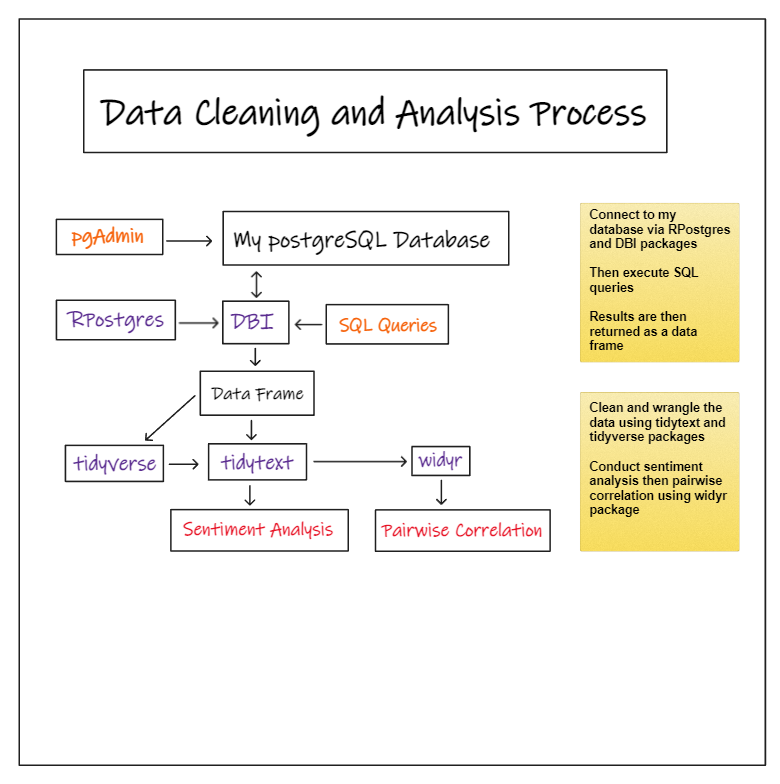
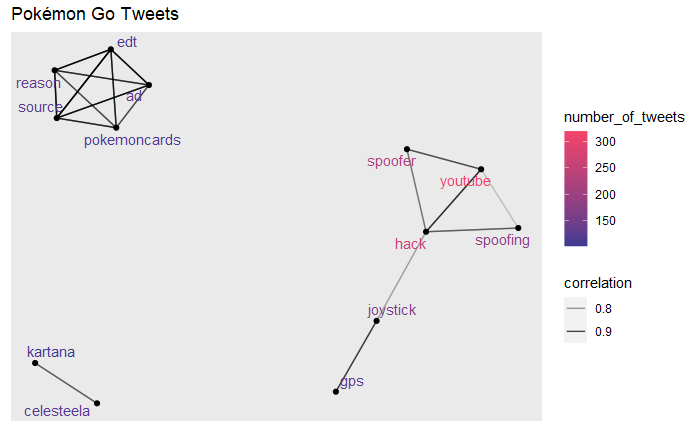

# **Twitter Analysis Project |**  **+**  **+** 
> ### **Sentiment Analysis: Tweets**
> - Collected Twitter data received from **Twitter API**, and stored this data within my own `database` using `R`, `pgAdmin4`, and `postgreSQL`.
> - Generated and executed `SQL` **queries** to `filter` and `join` data.
> - Cleaned and analyzed data, conducted a **sentiment analysis** and a **word correlation** analysis.
>
> *Click the icons below to see the project files and deliverables*
> | Analysis | ReadMe |
> | :-: | :-: |
> |[](https://bradfordjohnson.github.io/twitter-analysis-project/)|[](https://github.com/bradfordjohnson/twitter-analysis-project/blob/t/README.md)|

---
## **❓ Research Objectives** 
> This project was a way to learn about and implement several new ways to use `R`.
> 
> > **I. Collect data (Tweets) from Twitter using `R`**  
> > > A. Clean the data with `R`  
> > > B. Store all the data in a `postgreSQL` *database*  
> > 
> > **II. After a period of data collection, use R to connect to the database**  
> > > A. Use `SQL` to query the *database* via `R`  
> > > B. Store `SQL` *query* outputs as data frames for `R` analysis 
> >  
> > **III. Investigate insights in the data**  
> > > A. **Sentiment analysis**  
> > > B. **Word correlations**  
> > > C. Create **visualizations** showing both the sentiment and correlations. 
> >
> With all of those objectives in mind, my deliverable for this analysis is a `Quarto` website made in `R`, hosted via `GitHub Pages`.
## **💡 Inspiration**
> I wanted to see what other people were saying about the same topics I am interested in, and I also wanted to see if others were saying more positive or negative things about each respective topic. Those topics being: **Rocket League**, **Pokémon Go**, **TopGolf**, and the hashtag "**#rstats**".  
> 
> I picked **Rocket League** and **Pokémon Go** because I enjoy playing these games. **TopGolf** because I am currently working there as an *IT Team Lead*, so I thought it would be interesting to see this topic as I am not very aware of the wider public perception of the player experience. “**#rstats**” I picked because I wanted to have one hashtag included in this topic group, and I have not yet investigated the hashtag in detail. This will let me see more about the Tweets with this hashtag, and the **common themes** that are mentioned in "**rstats**". 
## **📊 The Data**
> I used the `rtweet` package to get the **Tweet** data by using the **Twitter API**, to use this `API` you must have a Twitter Developer Account, and be logged in with your default browser, this let the `rtweet` package authenticate your account and run the `search_tweets()` function.  
>  
> These are the packages I used for *collecting data*
``` r
library(tidyverse)
library(rtweet)
library(DBI)
library(RPostgres)
library(dplyr)
```
> Here is an example of the R code I used to get the **Rocket League** Tweets:   
``` r
auth_setup_default()
auth_has_default()

df <- search_tweets("rocket league", n = 1000, include_rts = FALSE, lang = "en")
```
> Once I got the data from the Twitter **API** I then split the data into two data frames
``` r
# data data frame
df1 <- df %>%
  select(id_str, retweet_count, favorite_count,  created_at)
# text data frame
df2 <- df %>%
  select(id_str, full_text, display_text_range, text)
 ```
 > Next I **imported** the data frames into my `SQL` database as tables  
 ``` r
# connect to database
con <- dbConnect(RPostgres::Postgres(),dbname = 'postgres',
      host = 'localhost',
      port = 5432,
      user = 'postgres',
      password = 'vannah')
# create tables in database
dbWriteTable(con, "rocketleague_data", df1, append = TRUE)
dbWriteTable(con, "rocketleague_text", df2, append = TRUE)
# disconnect from database
dbDisconnect(con)
```
> Running all this `code` once will get a maximum of **1,000 Tweets** and store every *Tweet* + *associated data* within 2 tables of my *SQL database*.  
> Running the `code` again will add to the pre-existing tables in the database.
> 
> For each topic the `code` was ran a different number of times so there was a **variation** in the amount of data collected.
## **📐 Methods**
> Collecting data flow chart 
> 
> Data cleaning and analysis flow chart
> 
## **📈 Findings**
> **Tweet Sentiment**  
>
> 
> 
> 
> 
>
> **Tweet Word Correlations**  
>
> 
> 
> 
> 
## **💬 Discussion and Thoughts**
> As you can see the **sentiment trends** and **word correlations** vary between the topics, some of the **word correlation** charts tell a much better story than the others, so I plan on exploring how adjusting other **parameters** can impact the story this visual tells about a topic. I also want to create an even more effective visual for the Tweet sentiment, and try coming up with `KPIs` that can even better interpret the state of a topic's "*performance*".
## **📖 Resources | Citations**
> [](https://docs.ropensci.org/rtweet/)
